# Vacancies Service Team Project
Telegram-бот для поиска и управления актуальными вакансиями. Бот парсит вакансии с сайтов компаний, предоставляет умные рекомендации и позволяет кандидатам и рекрутерам эффективно взаимодействовать.
# Состав команды
* Алексев Докучаев – Тимлид
* Петров Егор
* Арсений Рыбаков
* Георгий Аненко
* Анна Богословская 

# Графики и схемы

## Архитектура бота вакансий
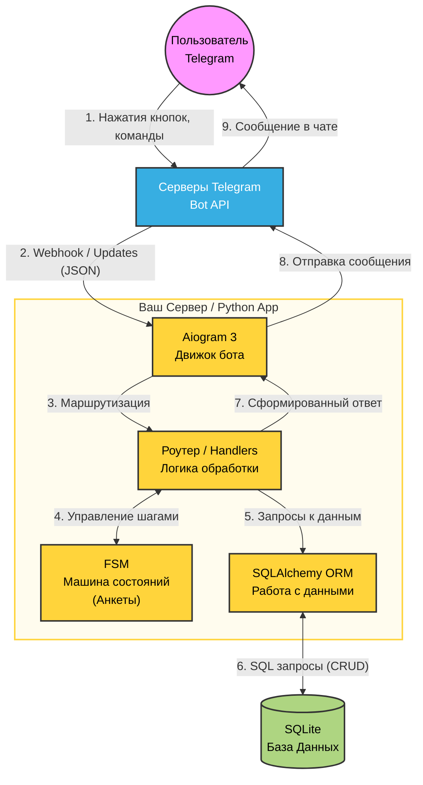

## Реляционная база данных
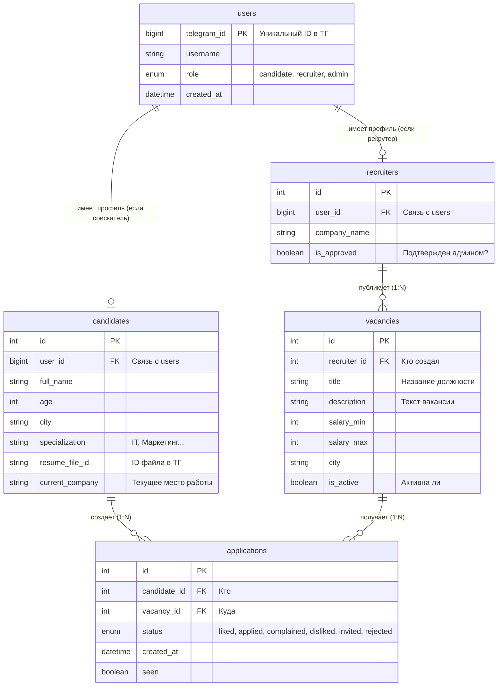

## Регистрация пользователей
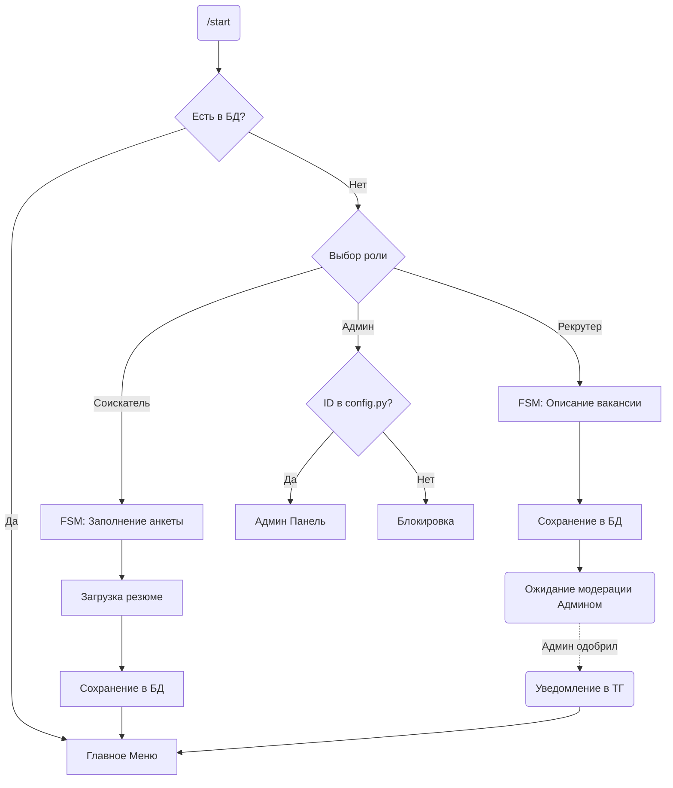

## Описание действий соискателя
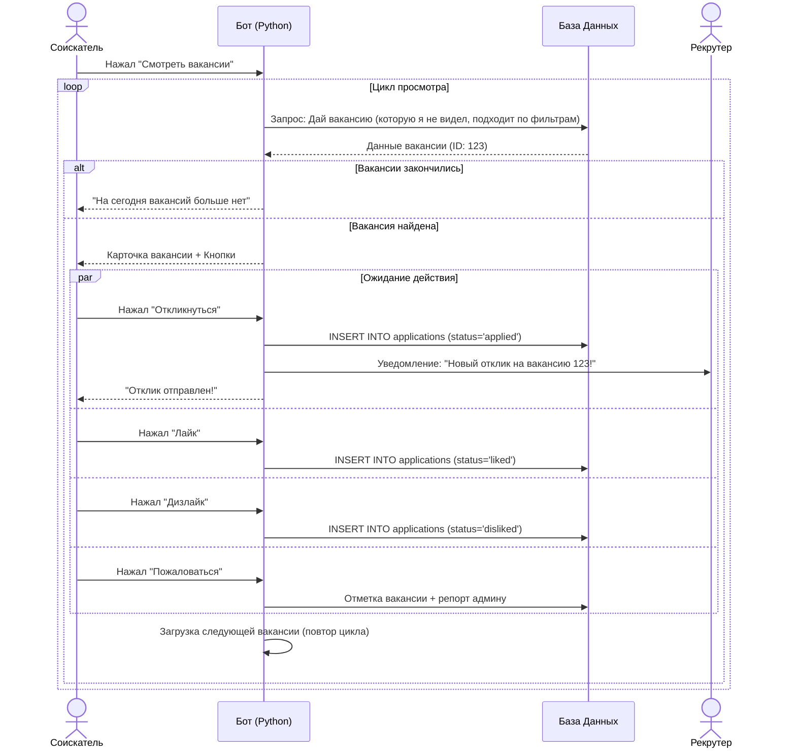

## Описание действий рекрутера
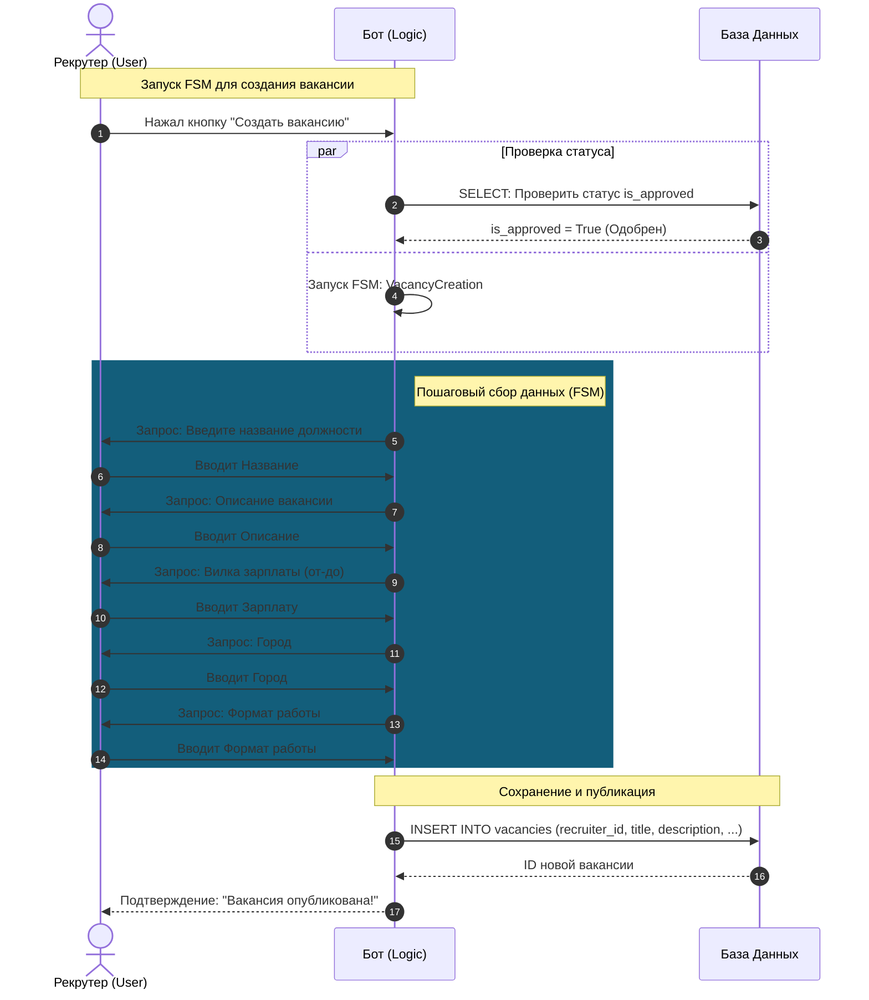

# Описание проекта

## Визуализация интерфейса пользователя

  
### Работа бота от лица соискателя

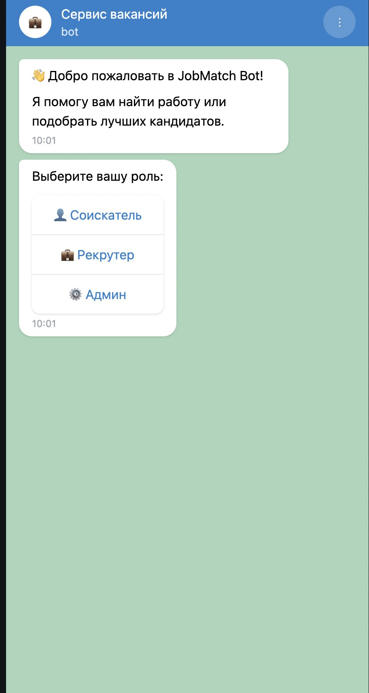
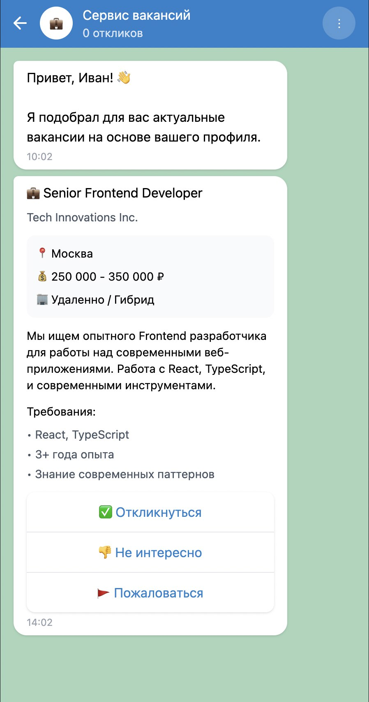
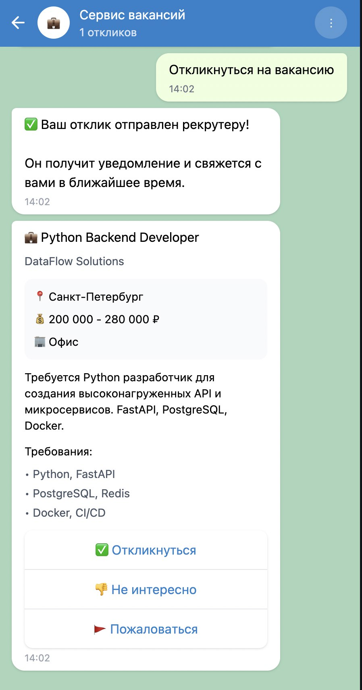
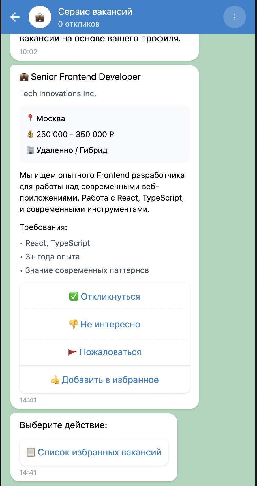

### Работа бота от лица рекрутера
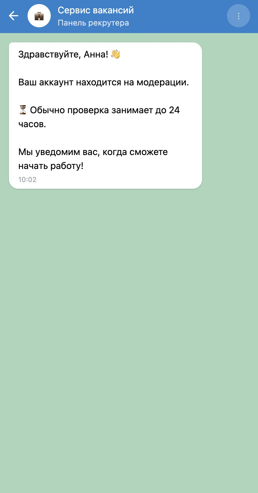

### Работа бота от лица админа
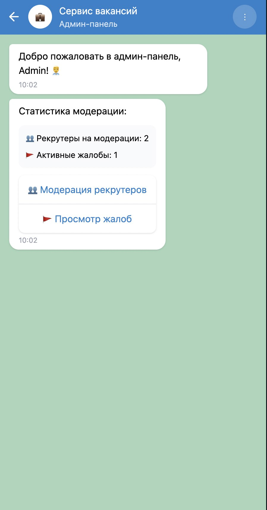

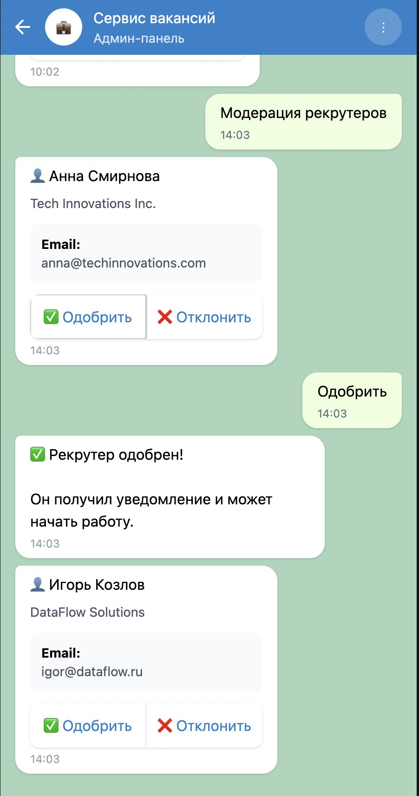

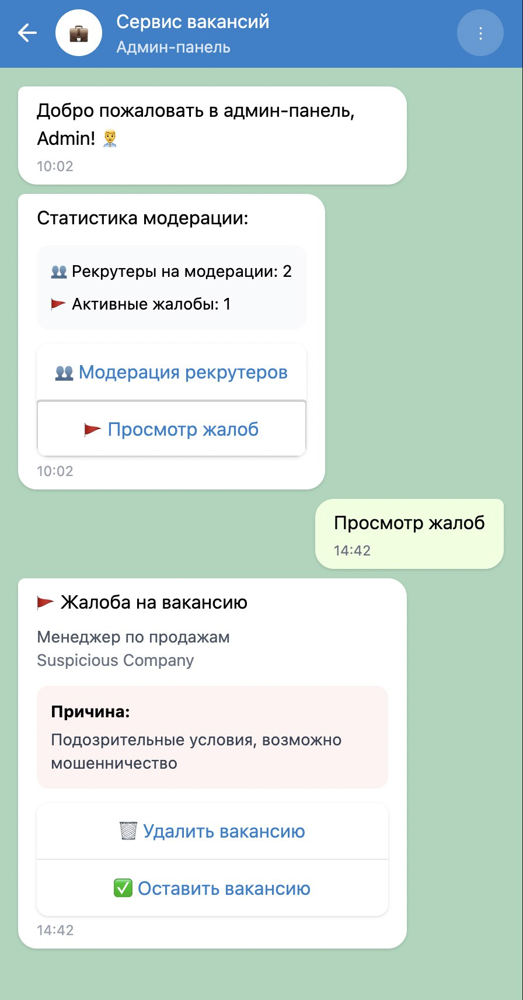

## Распределение задач, времени и  ролей в команде
| №  | Задача                           | Подзадачи (кратко)                                                  | Оценка (часы) | Ответственный |
|----|----------------------------------|----------------------------------------------------------------------|---------------|---------------|
| 1  | **Проектирование БД**              | User, Condidates, Recruiters, Application, Vacancies, роли, связи     | 10            |Алексей         |
| 2  | **Backend: auth и роли**            | регистрация/логин, JWT, роли (seeker/recruiter/admin)               | 8             | Егор          |
| 3  | **Backend: рекрутеры и соискатели**   | кнопки, связи с бд, обработка ошибок ввода                    | 8             | Георгий          |
| 4  | **Backend: вакансии**               | CRUD вакансий, статусы, фильтры, связь с компанией                  | 10            | Арсений          |
| 5  | **Backend: отклики (Application)**  | создание отклика, статусы, выборка откликов для рекрутера           | 8             | Анна          |
| 6  | **Backend: лайки/дизлайки**         | модель Reaction, логика скрытия “дизлайкнутых” вакансий             | 6             | Арсений             |
| 7  | **TG-бот: соискатель**              | регистрация, профиль, лента вакансий, фильтры, лайк/дизлайк, отклики| 12            | Егор          |
| 8  | **TG-бот: рекрутер**               | вход, создание/редактирование вакансий, просмотр откликов           | 12            | Анна             |
| 9 | **TG-бот: админ**                   | управление пользователями, ролями, компаниями                        | 10            | Георгий             |
| 10 | **Докер + деплой**                  | Dockerfile, docker-compose, запуск backend+БД+бота                  | 10            | Анна    |

# Стек технологий

| Технология                | За что отвечает |
|---------------------------|-----------------|
| **Python**                | Основная логика проекта, backend, работа с БД |
| **FastAPI**               | Backend API для бота, маршруты, обработка запросов |
| **PostgreSQL**            | Хранение пользователей, ролей, компаний, вакансий, откликов, лайков |
| **SQLAlchemy (async)**    | Асинхронная ORM, работа с БД, CRUD-операции |
| **Alembic**               | Миграции схемы БД (создание/изменение таблиц) |
| **Aiogram**               | Telegram-бот: сценарии для соискателя, рекрутера и админа |
| **Pydantic v2**           | Валидация и сериализация данных в API (модели запросов/ответов) |
| **python-dotenv**         | Загрузка конфигурации и секретов из `.env` (БД, токен бота, JWT-ключ) |
| **Docker / Docker Compose** | Запуск backend, БД и бота в контейнерах, единая среда, деплой |

